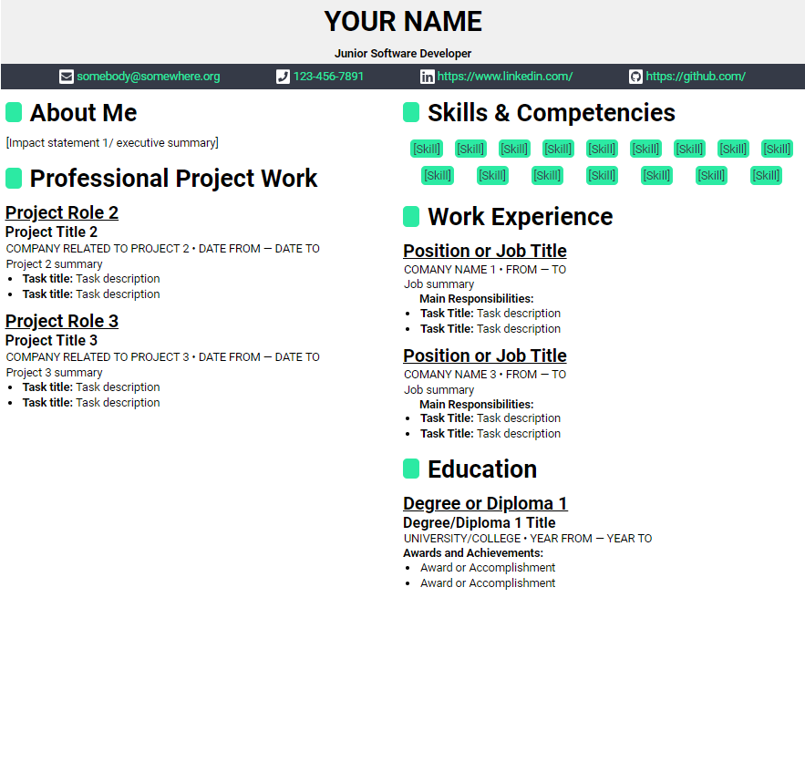

# jekyll-resume
A modern-looking resume built with Jekyll and powered by Github Pages

This template makes it easy to quickly make several custom-tailored resumes with minimum effort
(And they look cool, too 👌).
[Example - hosted on GitHub Pages](https://oroshi-tom.github.io/jekyll-resume-template/)
